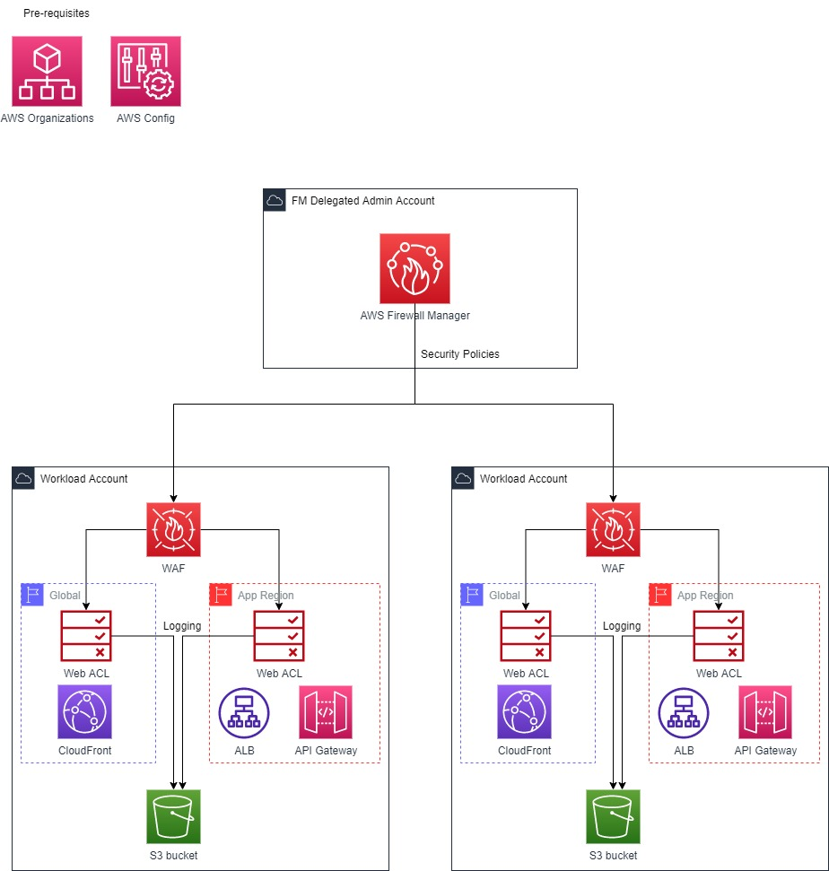
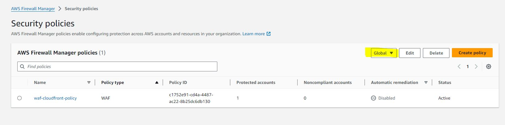

## Security

See [CONTRIBUTING](CONTRIBUTING.md#security-issue-notifications) for more information.

## License

This library is licensed under the MIT-0 License. See the LICENSE file.

## Description

### Use AWS Firewal Manager(FMS) to centrally configure and manage Web Application Firewall(WAF) rules across AWS accounts
AWS [Firewall Manager](https://docs.aws.amazon.com/waf/latest/developerguide/fms-chapter.html) is a security management service that allows you to centrally configure and manage firewall rules across your accounts and applications in AWS Organizations. In this sample we use FMS to centrally manage few AWS managed [WAF](https://docs.aws.amazon.com/waf/latest/developerguide/aws-managed-rule-groups.html) rules in all your accounts. These WAF rules are:
1. AWS Core rule set
1. AWS Linux operating system
1. AWS SQL database
1. AW Known bad inputs
1. AWS Anonymous IP list
1. AWS Amazon IP Reputation list
You can find the description of these rule groups here: [AWS Managed Rules rule groups list](https://docs.aws.amazon.com/waf/latest/developerguide/aws-managed-rule-groups-list.html)
Additionally it also creates a custom rule which prevents `cross-site scripting`, does `IP blocking` if you have identified a malicious IP or set of IPs and attach `rate limits` for individual requests generated from an IP. You can edit this rule to add more custom rule group

Additionally all the WAF logs will go to an s3 bucket in the individual accounts so that individual account owners can look at the WAF logs when needed.

## Architecture


## Author
- [Smita Srivastava](https://www.linkedin.com/in/smita-srivastava-664b9b1a/)

## Pre-requisites to use FMS
1. To use Firewall Manager, your account must be a member of the organization in the [AWS Organizations](https://docs.aws.amazon.com/organizations/latest/userguide/orgs_introduction.html)
1. [AWS Config](https://docs.aws.amazon.com/config/latest/developerguide/getting-started.html) needs to be enabled in all the AWS accounts you want to configure WAF rules through FMS
More on the pre-requisites can be found here: [AWS Firewall Manager prerequisites](https://docs.aws.amazon.com/waf/latest/developerguide/fms-prereq.html)

## Setup
This sample set creates two FMS security policies(WAF policy):
- [Protecting Cloudfront](security-policies/create-fms-security-policy-cf.yaml)
- [Protecting regional services like APIGateway and Application Load Balancer](security-policies/create-fms-security-policy-regional.yaml)

## Deployment
For successfull deployment, the steps must be followed <strong>in order</strong>. There is a deploy.sh file in each folder that deploys the Cloudformation stack based on the config values(a config file in each folder) present in each subfolder. Please update the config value based on your account information. You can also update the parameter values in each stack-set.

Firewall Manager(FMS) security policy deployment steps:
1. The security-policies stack-sets deploy the FMS security policy in FMS delegated admin account. Stackset is used to deploy in multiple regions in FMS delegated admin account. Since we are using stackset to deploy resources in one account(FMS delegated admin account), we will be self-managing the permission. This is a manual step and instructions are given here: https://docs.aws.amazon.com/AWSCloudFormation/latest/UserGuide/stacksets-prereqs-self-managed.html. Basically two roles need to be created in the main administrator account and FMS Manager delegated account respectively. We need these roles arn in step 3
1. First we will set up WAF logging in individual accounts. This is done at first because as soon as FMS creates a WAF web ACL, the logging starts immediately. If you do not need WAF logging to be enabled, you can skip this step and go to step 2 directly.
  
    1.1 Create the s3 bucket in all the accounts for the given Org OU in the [config](create-s3-bucket/config) file. This needs Org OU to create s3 buckets in each account by using stacksets, but s3 bucket will only be created in 'us-east-1' region and all the logs from other regions will come in this bucket. Update the config with necessary data and run ./deploy.sh in your favourite command line after setting AWS credentials. These credentials will be of the administrator account(Note this is not the FMS delegated admin account). You can alternatively use [AWS CloudShell](https://aws.amazon.com/cloudshell). 
    ```
    cd create-s3-bucket
    ./deploy.sh
    ```
    Alternatively you can update the deploy.sh file to incluse only specific accounts if you do not want stackset to create s3 bucket in all the accounts of the organization unit. The [create-s3-log-bucket.yaml](create-s3-bucket/create-s3-log-bucket.yaml) can be directly run in aws console in stacksets.
    
    1.2 Enable WAF logging and use the s3 bucket created in step 1.1 to store logs. This is done by [s3-logging-on-webacls.yaml](enable-s3-logging/s3-logging-on-webacls.yaml) file. This needs to done in every account/every region supported. Hence this is using stackset to deploy. Update the config with necessary data and run ./deploy.sh in your favourite command line after setting AWS credentials. These credentials will be of the administrator account(Note this is not the FMS delegated admin account). You can alternatively use [AWS CloudShell](https://aws.amazon.com/cloudshell). 
    ```
    cd enable-s3-logging
    ./deploy.sh
    ```
1. Once the roles are created in Step 1, use that and update the [config](security-policies/config) file. Add in other details in the config file and run './deploy.sh' in your favoutite command line after setting AWS credentials. These credentials will be of your main administrator account. This will create the necessary CloudFront and Regional security policies in the FMS delegated admin account in the regions specified in the deploy.sh file. For now `us-east-1`(for global resource like CloudFront) and two regions `us-east-1`, `us-east-2`(for regional resources) regions are added.
    ```
    cd security-policies
    ./deploy.sh
    ```
    All the web ACLs will b created in 'COUNT' mode. Once you have done thorough testing, you can replace the `OVERIDEACTION` in [config](security-policies/config) and run `./deploy.sh` again. Read more about [web ACL action overrides](https://docs.aws.amazon.com/waf/latest/developerguide/web-acl-rule-group-override-options.html)

## Validation
You need to wait for approximately 2-5 minutes for the Firewall manager policies to get created. To successfully verify that your resources got created successfully, do the below steps in the console:
1. For Global, Go to Firewall Manager(FMS Delegated admin account) -> Security Polices -> Change the region to `Global` : "You should see a FMS security polict named `waf-cloudfront-policy`
 
1. For regional, Go to Firewall Manager(FMS Delegated admin account) -> Security Polices -> Change the region to `us-east-1` or `us-east-2` : "You should see a FMS security polict named `waf-regional-policy`
1. Now login to individual accounts accounts and you should see WAF rules created and managed by FMS.


## Clean up
To release your cloud resources and avoid ongoing costs once you're finished exploring this sample, you can delete the created stacks in [AWS CloudFormation](https://console.aws.amazon.com/cloudformation/home?#/stacks/)

